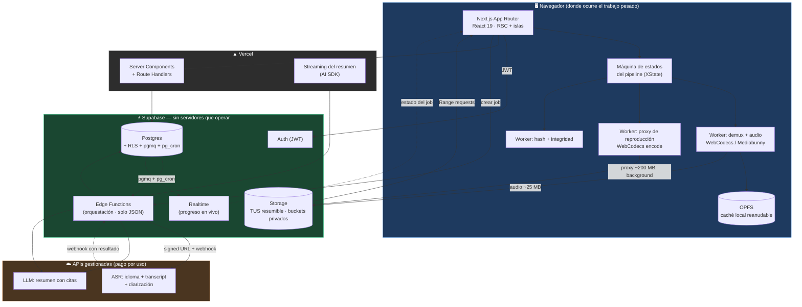
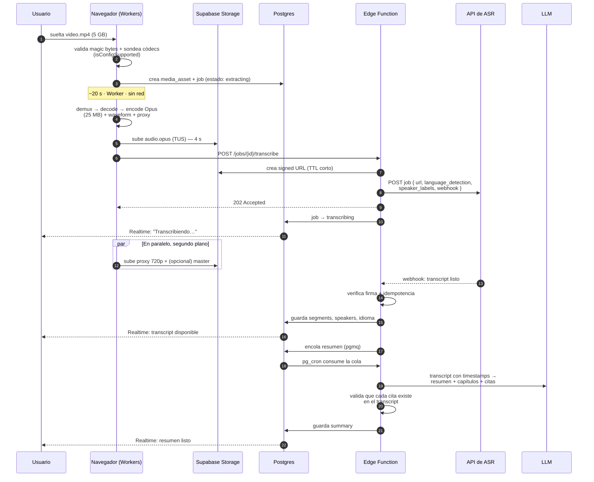
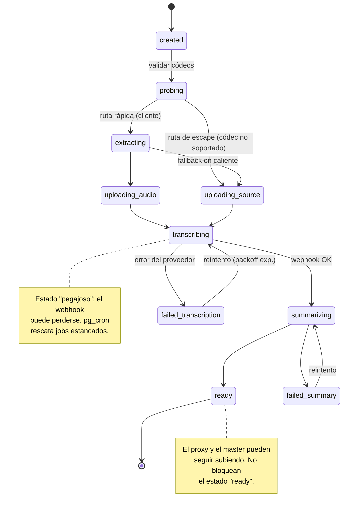

# 03 — Arquitectura del sistema

## Vista de componentes

**Lo que hay que leer en este diagrama:** las flechas gruesas de datos (audio, proxy, video,
reproducción) van **del navegador directo a Storage** y de vuelta. Ninguna atraviesa Vercel ni
una Edge Function. Nuestro código solo aparece en las flechas finas, que llevan JSON.

## Los tres carriles de ejecución

El diseño separa el trabajo en tres carriles con velocidades y prioridades muy distintas.
Entender esta separación es entender el sistema entero.

| Carril | Qué transporta | Tamaño típico (video de 2 h) | Latencia | Prioridad |
|---|---|---|---|---|
| 🟢 **Rápido — Análisis** | Audio comprimido (Opus mono 16 kHz) | ~25 MB | segundos | **Máxima.** Bloquea el resultado |
| 🟡 **Medio — Reproducción** | Proxy de video (720p, CRF alto) | ~200-400 MB | minutos, en background | Media. Necesario para ver el video |
| 🔴 **Lento — Archivado** | Master original | 5 GB | ~13 min o más | **Opcional.** Solo si el usuario lo pide |

El carril rojo es opcional a propósito: *analizar* un video no requiere *conservarlo*. Ver
[09-costes-y-limites.md](./09-costes-y-limites.md).

## Flujo principal — de soltar el archivo al resumen

### Puntos de diseño no obvios en este flujo

**Paso 3 — el job se crea antes de subir nada.** El estado vive en Postgres desde el primer
momento. Si el usuario cierra la pestaña en el paso 6, al volver encuentra el job y puede
reanudar. No hay estado efímero en memoria del cliente.

**Paso 10 — el paralelismo es el producto.** El transcript llega mientras el video todavía
sube. La UI está diseñada para que eso se vea y se sienta como una ventaja, no como algo a
medias.

**Paso 11 — webhook, no polling.** El ASR nos avisa. Un `pg_cron` de respaldo detecta jobs
`transcribing` estancados más de N minutos y hace polling de rescate, porque los webhooks se
pierden.

**Paso 12 — verificación e idempotencia.** Los webhooks se reintentan y llegan duplicados.
La escritura es idempotente por `job_id` (`ON CONFLICT DO NOTHING`).

**Paso 16 — el resumen se valida contra el transcript.** Si el LLM cita `14:32` y no existe
un segmento en esa marca, la afirmación se descarta. Esto convierte "resumen con timestamps"
de una promesa a una garantía verificable. Ver [05-pipeline-analisis.md](./05-pipeline-analisis.md).

## Máquina de estados del job

Un job es una fila en Postgres con un estado explícito. Todo el sistema — UI, reintentos,
observabilidad — se deriva de aquí.

## Responsabilidades por componente

### Navegador — el motor de procesamiento

Concentra todo lo caro. Dentro de Web Workers, nunca en el hilo principal:

- **Sondeo de capacidades**: `VideoDecoder/AudioDecoder.isConfigSupported()` decide la ruta.
- **Demux y decodificación** con Mediabunny sobre WebCodecs.
- **Codificación del audio** a Opus mono 16 kHz (suficiente para ASR, ~200× más pequeño).
- **Generación del proxy** de reproducción y de la forma de onda.
- **Subida TUS** con paralelismo controlado y backpressure.
- **Caché en OPFS** para reanudar tras recargar la página.

### Vercel — la capa de presentación

- Server Components para la carga inicial de datos (transcript, resumen): HTML directo, sin
  cascadas de fetch en cliente.
- Route Handlers para lo que necesita streaming al usuario (el resumen token a token).
- **Nunca** recibe archivos. El límite de 4,5 MB lo hace imposible, y eso es correcto.

### Supabase — el sistema nervioso

- **Auth**: emite el JWT que gobierna storage y base de datos.
- **Postgres**: fuente única de verdad del estado. RLS como capa de autorización.
- **Storage**: buckets privados, subida TUS directa, entrega por CDN con `Range`.
- **Edge Functions**: orquestadores puros. Reciben JSON, llaman APIs, escriben filas.
  Nunca abren un archivo de media.
- **pgmq + pg_cron**: cola con reintentos y backoff, y el barrido de jobs estancados.
- **Realtime**: empuja los cambios de estado a la UI. Cero polling desde el cliente.

### APIs externas

- **ASR** (AssemblyAI por defecto): idioma, transcript con timestamps de palabra, diarización.
  Detrás de una interfaz `TranscriptionProvider` para no casarnos.
- **LLM** (Claude): resumen, capítulos y sugerencia de nombres de hablante.

## Qué pasa cuando algo falla

| Fallo | Comportamiento | Impacto para el usuario |
|---|---|---|
| El usuario cierra la pestaña durante la subida | TUS + OPFS reanudan desde el último chunk confirmado | Ninguno, continúa donde iba |
| Se cae la red a mitad de subida | Reintento con backoff exponencial y jitter | Barra pausada, luego continúa |
| El navegador no soporta el códec | Detectado *antes* de empezar → ruta de escape | Más lento, se le avisa |
| El webhook del ASR se pierde | `pg_cron` detecta el job estancado y hace polling | Retraso, no pérdida |
| Webhook duplicado | Escritura idempotente por `job_id` | Ninguno |
| El ASR devuelve error | Reintento con backoff; tras N intentos → `failed` con causa legible | Mensaje claro y opción de reintentar |
| El LLM alucina un timestamp | La validación contra segmentos descarta la afirmación | Resumen algo más corto, nunca incorrecto |
| El usuario sube un archivo corrupto | Falla en el demux en cliente, antes de gastar red o dinero | Error inmediato y barato |
