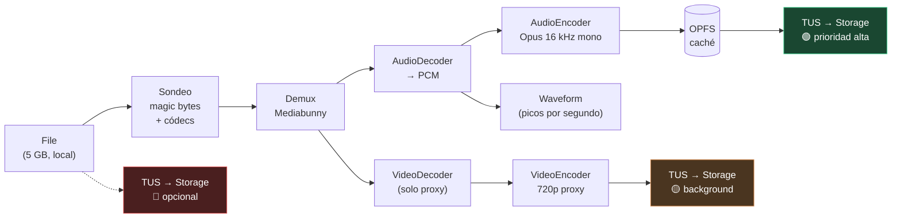

# 04 — Ingesta y upload

Este documento trata la pregunta que abrió el proyecto: *"¿cómo hacemos que un video de varios
gigas se suba muy rápido con chunking y pipes?"*

La respuesta corta es incómoda pero libera el diseño: **el chunking no hace que suba más
rápido. Lo que hace que sea rápido es no subir el video para analizarlo.**

---

## 1. La física del problema

Antes de diseñar nada, los números:

```
Archivo: 5 GB (MP4, 2 h, 1080p)
Subida doméstica típica: 50 Mbps  =  6,25 MB/s  →  ~13 min 20 s
Subida de fibra buena:  300 Mbps  =   37,5 MB/s →  ~2 min 13 s
```

**Trocear el archivo no cambia estos números.** El ancho de banda de subida del usuario es una
constante física; dividir los bytes en paquetes más pequeños no crea capacidad nueva.

### Entonces, ¿para qué sirve el chunking?

Sirve, y mucho — pero no para lo que la intuición sugiere:

| Beneficio real | Por qué |
|---|---|
| **Reanudabilidad** | Una caída de red a los 11 minutos no reinicia desde cero. Es *la* razón principal |
| **Saturar el enlace** | Una sola conexión TCP rara vez satura un enlace con latencia alta (slow start, ventana de congestión). 4-6 chunks en paralelo dan **1,5-3× de ganancia real** |
| **Progreso honesto** | Se sabe exactamente cuántos bytes están confirmados, no estimados |
| **Backpressure** | El cliente ajusta la concurrencia según la red, en vez de saturar y perder paquetes |
| **Deduplicación** | Con el hash calculado por adelantado, un archivo ya subido cuesta **0 bytes** |
| **Memoria acotada** | Nunca se carga el archivo entero en RAM, ni en cliente ni en servidor |

Ese último punto es el corazón del material de Erick Wendel sobre upload de gigabytes con
Node.js, y sigue siendo válido aquí: **el pipeline procesa por trozos con consumo de memoria
constante, independiente del tamaño del archivo.**

Pero con todos esos beneficios aplicados, 5 GB siguen tardando ~13 minutos. Si el análisis
espera a que la subida termine, el producto es lento. Punto.

---

## 2. La idea que cambia el orden de magnitud

Para transcribir y diarizar **no necesitamos el video. Necesitamos el audio.**

Y el audio, para reconocimiento de voz, no necesita calidad musical:

```
Video 1080p H.264, 2 h  ────────────────────────────────────  5 000 MB
  └─ pista de audio AAC estéreo 192 kbps  ─────────────────     170 MB
       └─ re-codificada a Opus mono 16 kHz @ 24 kbps  ──────      22 MB
```

**22 MB frente a 5 GB. Unas 227× menos.** A 50 Mbps, eso son **3,5 segundos** en vez de
13 minutos.

Y el mono a 16 kHz no es una degradación para este caso: es el formato en el que los modelos
de ASR trabajan internamente. Enviar 1080p a un modelo de voz es desperdicio puro.

### Comparación de las dos rutas

```
❌ Ruta clásica (la que obligaría un backend propio):
   ├─ subir 5 GB ...................................... 13 min 20 s
   ├─ el servidor extrae el audio con ffmpeg .........      45 s
   ├─ transcribir + diarizar .........................       6 min
   └─ resumir ........................................      20 s
   ⏱  Primer resultado visible: ~20 minutos

✅ Ruta audio-first (la nuestra):
   ├─ extraer audio en el navegador (WebCodecs) ......      20 s
   ├─ subir 22 MB ....................................       4 s
   ├─ transcribir + diarizar .........................       6 min
   └─ resumir ........................................      20 s
   ⏱  Primer resultado visible: ~7 minutos
   ⏱  Idioma detectado + primeras líneas: ~60 s
   📦 ...y el video sigue subiendo en segundo plano, sin bloquear nada
```

La clave no es solo que sea 3× más rápido. Es que **el tiempo hasta el primer resultado ya no
depende del tamaño del video**. Un archivo de 20 GB tarda casi lo mismo que uno de 2 GB en dar
transcript, porque el audio de ambos pesa lo mismo por minuto.

---

## 3. El pipeline de ingesta

Todo ocurre en Web Workers. El hilo principal solo pinta la UI.



### Etapa 0 — Sondeo (instantáneo, antes de tocar la red)

Tres comprobaciones baratas que evitan gastar tiempo y dinero:

1. **Magic bytes**: leer los primeros ~64 bytes y confirmar que es realmente un contenedor de
   video. La extensión del archivo no es evidencia de nada.
2. **`isConfigSupported()`** de WebCodecs: ¿puede este navegador decodificar estas pistas?
   Decide entre ruta rápida y ruta de escape **antes** de empezar.
3. **Hash de muestreo**: hash de los primeros y últimos 8 MB + tamaño. Suficiente para detectar
   un archivo ya subido sin leer 5 GB.

### Etapa 1 — Extracción de audio (~20 s para 2 h de video)

**Mediabunny sobre WebCodecs** hace el demux del contenedor, decodifica la pista de audio con
aceleración por hardware y la re-codifica a Opus.

Por qué **WebCodecs y no `ffmpeg.wasm`**:

| | WebCodecs | ffmpeg.wasm |
|---|---|---|
| Rendimiento | **7-10× más rápido**, y la brecha crece con la duración | Emula el binario completo en una VM WASM |
| Aceleración por hardware | Sí, usa los decodificadores del SO | No, todo por software |
| Peso descargado | ~0 (API del navegador) | ~25-30 MB de WASM |
| Cobertura de códecs | Los que soporte el navegador | Prácticamente todos |
| Demux/mux | Requiere librería (Mediabunny) | Incluido |

Elegimos WebCodecs por rendimiento y peso. `ffmpeg.wasm` queda como posible tercera ruta para
códecs exóticos, pero **la ruta de escape preferida es delegar el demux al ASR**, que es gratis
para nosotros y no añade 30 MB al bundle.

> ⚠️ **Caveat conocido**: un MP4 sin `faststart` tiene el índice (`moov`) al final del archivo.
> Mediabunny hace lecturas aleatorias con `Blob.slice()`, que sobre un `File` local es barato
> (no hay red de por medio), así que no es un bloqueante — pero hay que preverlo en el diseño
> y no asumir lectura secuencial.

### Etapa 2 — Subida por carriles

Los tres carriles ([ver 03](./03-arquitectura-sistema.md#los-tres-carriles-de-ejecución)) compiten
por el mismo enlace de subida. El orden importa:

- El **audio** monopoliza el ancho de banda hasta terminar (son segundos).
- El **proxy** arranca después, con concurrencia reducida.
- El **master** (si se pide) va al final, con la prioridad más baja.

El planificador se implementa como una cola de prioridades sobre el número de subidas TUS
concurrentes. Es, literalmente, **backpressure aplicado a la red**: un solo lugar decide
cuántos chunks hay en vuelo, y lo ajusta según el throughput observado.

### Configuración TUS

- Endpoint: `/storage/v1/upload/resumable` de Supabase Storage.
- `chunkSize`: **exactamente 6 MB** (requisito de Supabase, no negociable).
- Autorización: JWT del usuario en la cabecera. La política RLS sobre `storage.objects` decide
  si puede escribir en esa ruta. **La subida no pasa por ningún código nuestro.**
- Reintentos: backoff exponencial con jitter (`2s, 4s, 8s, 16s`), respetando `Retry-After`.
- Estado del upload persistido en **OPFS**, para reanudar tras cerrar el navegador.
- Límite superior: **50 GB** por archivo en plan Pro.

---

## 4. De Node.js Streams a Web Streams

El material de Erick Wendel sobre upload escalable y sobre Streams se traduce casi línea por
línea a este diseño. Cambia el runtime, no el modelo mental:

| Concepto (Node.js) | Equivalente aquí | Dónde se aplica |
|---|---|---|
| `fs.createReadStream()` | `File.stream()` / `Blob.slice()` | Leer el video local sin cargarlo en RAM |
| `stream.pipeline()` | `ReadableStream.pipeThrough().pipeTo()` | Encadenar demux → decode → encode |
| `Transform` | `TransformStream` | Cada etapa del pipeline de audio |
| **Backpressure** | El `desiredSize` del `WritableStream` frena al productor | Evita llenar la RAM con frames decodificados |
| `highWaterMark` | Cola acotada entre decoder y encoder | Controla cuántos frames hay en vuelo |
| Worker threads | **Web Workers** | Todo el pipeline fuera del hilo principal |
| Progreso en el pipe | `TransformStream` contador + `postMessage` | La barra de progreso es parte del pipeline |
| Upload por chunks (`busboy`/multipart) | **Protocolo TUS** | Resumible y estandarizado, en vez de artesanal |

**La diferencia grande**: en el mini-curso, el servidor Node recibe los chunks y los ensambla.
En nuestro diseño, **no hay servidor en esa ruta**. El navegador habla directamente con el
object storage. Lo que en Node sería el handler de upload aquí es una política de RLS en SQL.

El backpressure sigue siendo el concepto central, pero opera en dos sitios a la vez:
1. **Dentro del worker**: el encoder de Opus marca el ritmo al decoder, para que no se acumulen
   frames PCM en memoria.
2. **En la red**: el planificador de carriles marca cuántos chunks TUS van en vuelo.

---

## 5. Riesgos de esta estrategia

| Riesgo | Mitigación |
|---|---|
| El navegador no soporta el códec | Detección previa con `isConfigSupported()` → ruta de escape (subir original, demux del lado del ASR) |
| Soporte desigual de WebCodecs entre navegadores | Matriz de soporte probada en CI; la ruta de escape es siempre funcional. Nunca un callejón sin salida |
| Dispositivo lento (portátil viejo, móvil) | La extracción tarda más, pero sigue siendo mucho mejor que subir 5 GB. Se muestra progreso real |
| Batería / móvil en 4G | Detectar `navigator.connection` y ofrecer "solo análisis, sin subir el video" |
| MP4 sin `faststart` | Lecturas aleatorias sobre `File` local — asumido en el diseño |
| El usuario cierra la pestaña a mitad de extracción | Progreso cacheado en OPFS; al volver se reanuda |
| Audio de mala calidad (ruido, solapamientos) | Fuera de nuestro control; se refleja en la confianza por palabra que devuelve el ASR y se marca en la UI |
