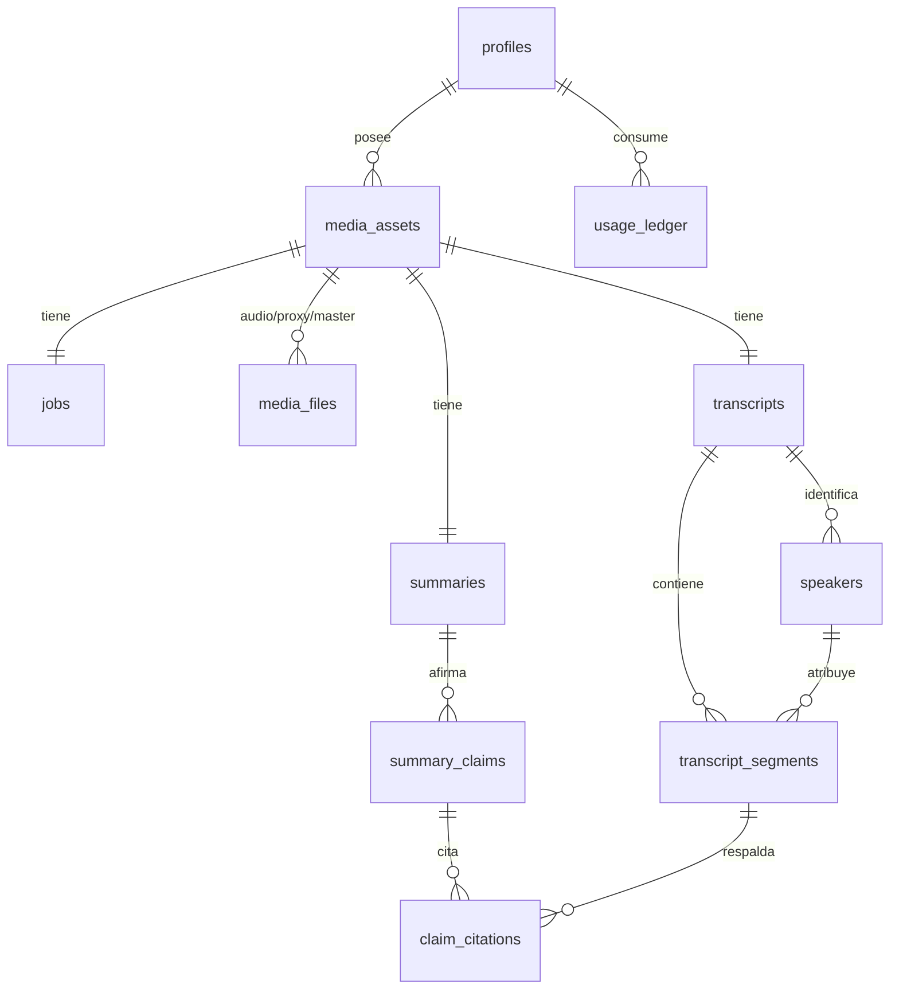

# 07 — Modelo de datos

Esquema de alto nivel. Los tipos exactos y los índices se afinan en la Fase 0.

## Principios

1. **El job es una fila.** Todo el estado del pipeline vive en Postgres. Reintentar es releer
   una fila, no reconstruir contexto.
2. **RLS en todas las tablas, sin excepción.** La autorización se declara en SQL una vez, no en
   cada handler. Si una tabla no tiene política, está rota.
3. **Los timestamps del media en milisegundos enteros** (`int`), nunca en segundos flotantes.
   Evita errores de redondeo al sincronizar citas con el reproductor.
4. **Los segmentos se guardan como filas, no como un JSON gigante.** Hacen falta índices por
   rango temporal, búsqueda de texto y actualización de hablante sin reescribir todo.

## Diagrama



## Tablas

### `profiles`
Extiende `auth.users`. Cuota mensual, plan, preferencias.

### `media_assets`
La unidad de producto: "un video analizado".
`id`, `owner_id`, `original_filename`, `size_bytes`, `duration_ms`, `content_hash`,
`ingest_route` (`fast` | `escape`), `created_at`, `deleted_at`.

`content_hash` permite deduplicar: si el usuario sube el mismo archivo, se reutiliza el
análisis y se ahorra el coste de ASR.

### `media_files`
Los tres carriles ([ver 03](./03-arquitectura-sistema.md#los-tres-carriles-de-ejecución)), cada
uno con su ciclo de vida independiente.
`media_asset_id`, `kind` (`audio` | `proxy` | `master` | `waveform`), `storage_path`,
`size_bytes`, `upload_state`, `bytes_uploaded`, `codec`, `expires_at`.

`expires_at` habilita la política de retención automática sin tocar `media_assets`.

### `jobs`
El estado del pipeline. Una fila por asset.
`media_asset_id`, `state` (enum de [03](./03-arquitectura-sistema.md#máquina-de-estados-del-job)),
`provider`, `provider_job_id`, `webhook_token`, `attempts`, `last_error`,
`state_changed_at`, `heartbeat_at`.

- `webhook_token`: secreto aleatorio por job, parte de la URL del webhook. Segunda barrera
  además de la verificación de firma.
- `heartbeat_at`: lo usa el barrido de `pg_cron` para detectar jobs estancados.
- `provider` + `provider_job_id`: permite rescatar por polling si el webhook se pierde.

### `transcripts`
`media_asset_id`, `language_code`, `language_confidence`, `provider`, `model_version`,
`word_count`, `created_at`.

`model_version` es clave: cuando el proveedor mejora el modelo, hay que saber qué transcripts
se generaron con cuál.

### `transcript_segments`
El volumen real (miles de filas por video).
`transcript_id`, `idx`, `start_ms`, `end_ms`, `speaker_id`, `text`, `confidence`,
`words` (`jsonb` con timestamps por palabra).

Índices: `(transcript_id, start_ms)` para el salto temporal, y GIN sobre `to_tsvector(text)`
para búsqueda. Las palabras van en `jsonb` porque se leen en bloque con el segmento y nunca se
consultan de forma independiente.

### `speakers`
`transcript_id`, `label` (`Speaker A`), `display_name` (editado por el usuario),
`suggested_name`, `suggestion_evidence_ms`, `suggestion_confidence`, `color_index`,
`total_speaking_ms`.

Separar `label` de `display_name` es lo que permite renombrar sin tocar los miles de segmentos:
se actualiza **una fila** y la UI resuelve el nombre por join.

### `summaries`, `summary_claims`, `claim_citations`
El resumen no es un blob de texto. Es un grafo de afirmaciones citadas:

- `summaries`: `media_asset_id`, `headline`, `abstract`, `chapters` (`jsonb`), `model`, `created_at`.
- `summary_claims`: `summary_id`, `kind` (`key_point` | `decision` | `action_item`), `text`,
  `owner_speaker_id`, `order_idx`.
- `claim_citations`: `claim_id`, `segment_id`, `start_ms`.

**La clave foránea `claim_citations.segment_id` es el mecanismo de integridad del producto**:
una cita no puede existir si no apunta a un segmento real. Si el LLM inventa un timestamp, el
`INSERT` falla y la afirmación se descarta. La base de datos hace cumplir la promesa.

### `usage_ledger`
`owner_id`, `media_asset_id`, `kind` (`asr_minutes` | `llm_tokens` | `storage_bytes` | `egress_bytes`),
`quantity`, `cost_micros`, `occurred_at`.

Registro append-only. Permite aplicar cuotas en la base de datos (no en el cliente) y saber el
coste real por usuario desde el primer día, antes de que la factura sorprenda.

---

## Storage

Un único bucket **privado**, con la ruta derivada del propietario:

```
media/
  {user_id}/
    {media_asset_id}/
      audio.opus        ← 🟢 carril rápido  · ~22 MB
      proxy.mp4         ← 🟡 reproducción   · ~200-400 MB
      master.mp4        ← 🔴 opcional       · varios GB
      waveform.bin      ← picos precalculados para el canvas
```

- El `user_id` como primer segmento hace que la política RLS sea trivial y a prueba de errores.
- Los identificadores son **UUID**, no correlativos: una signed URL filtrada no permite
  enumerar los archivos de otros.
- **Nunca un bucket público.** Un bucket público salta el control de acceso por completo.

### Política RLS sobre `storage.objects` (forma)

```sql
-- El primer segmento de la ruta debe ser el uid del usuario autenticado
create policy "usuario accede solo a su carpeta"
on storage.objects for all
to authenticated
using  (bucket_id = 'media' and (storage.foldername(name))[1] = auth.uid()::text)
with check (bucket_id = 'media' and (storage.foldername(name))[1] = auth.uid()::text);
```

Esta política es la que hace posible que **el navegador suba directamente a Storage sin pasar
por código nuestro**. Es la pieza que sustituye al handler de upload de un backend tradicional.

## Realtime

La UI se suscribe a cambios de `jobs` filtrados por `media_asset_id`. El progreso llega
empujado; el cliente no hace polling nunca. El filtro de Realtime respeta RLS, así que un
usuario no puede suscribirse a los jobs de otro.

## Retención y borrado

- `media_assets.deleted_at` marca el borrado lógico e **inmediatamente revoca el acceso** vía RLS.
- Un `pg_cron` nocturno purga objetos de Storage y filas más allá de la ventana de retención.
- El `master` tiene retención propia y más corta por defecto: es lo caro y lo menos necesario.
- Borrado en cascada desde `media_assets`: no deben quedar segmentos huérfanos.
